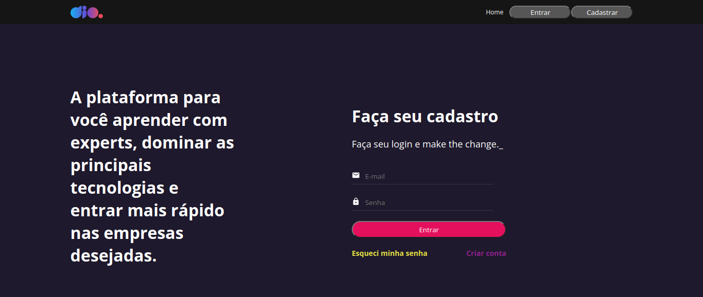
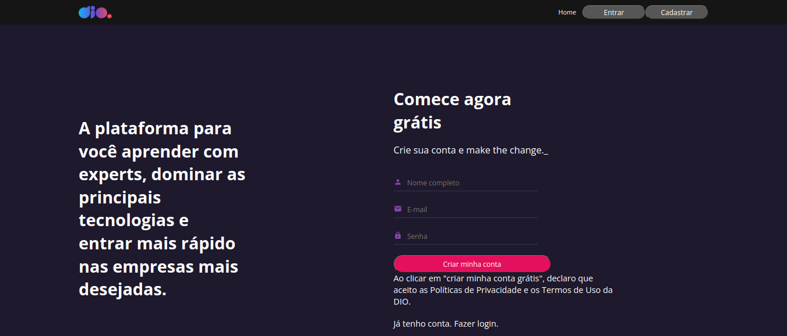
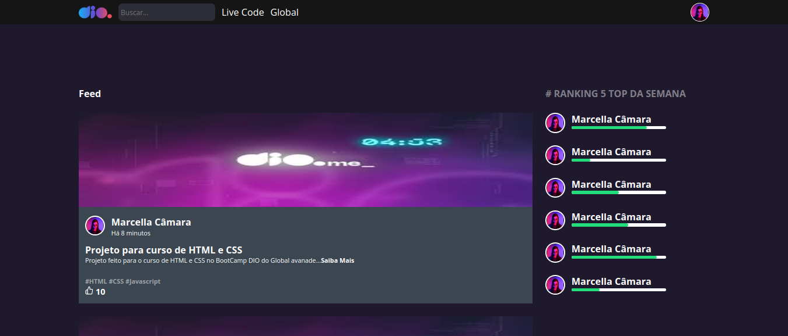

# Desafio: Recriar as páginas da DIO

Clone das páginas da plataforma DIO utilizando React. Este projeto foi um dos desafios lançados no Bootcamp Orange Tech+ Inter em parceria com a Digital Innovation One.

HOME


LOGIN


REGISTER


FEED


## Como rodar o projeto:

- Clonar o repositório:

```bash
  git clone https://github.com/marcellacamara/dio-page-clone.git
```

- Instalar as dependências:

```bash
  npm install
  cd dio-page-clone
```

- Executar o projeto:

```bash
npm start
```

## Autores

- Feito com 💜 por [@marcellacamara](https://www.github.com/marcellacamara).
